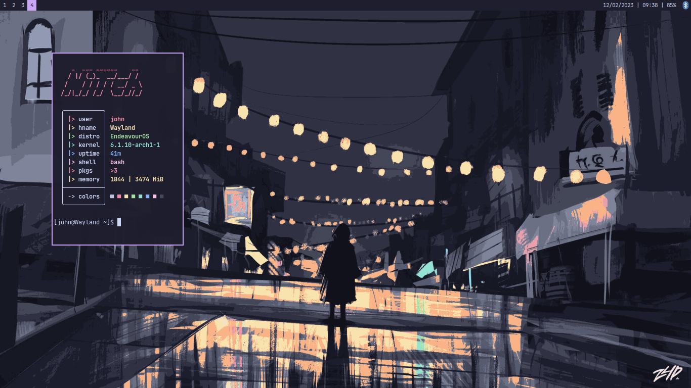

# My [Sway's](https://swaywm.org) configurations files and instalation script.  

# Things to know:  
- The script `instalar.sh` (which stands for install.sh, I speak portuguese) is intended to be used on a basic  
instalation of [EndeavourOS](https://endeavouros.com/) (it is the "No Desktop" option on the instaler), I didn't test it on  
a pure Arch install, maybe it will work fine, you'll only need Yay installed for the script to work properly.  
- The script installs **A LOT** of things, so feel free to remove some parts to suit your needs.  
- All of the keybinds are in the "keys" file, located on ~/.config/sway/  
- As I said on the first point, I speak portuguese, so maybe (probably) you'll find some comments of the files writen in portuguese. Sorry about that, but it is what it is and i'm not gonna change it that soon.  

# Catppuccin go brrrrr  

